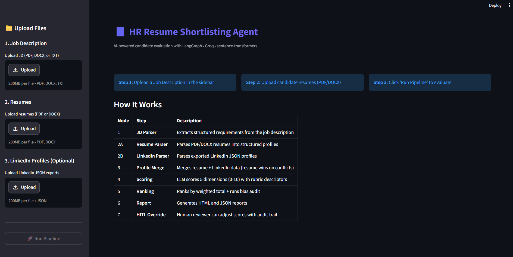
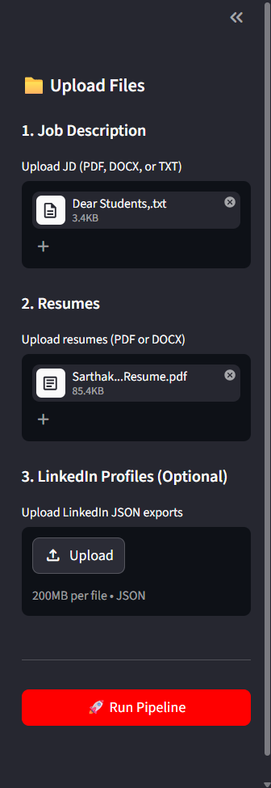
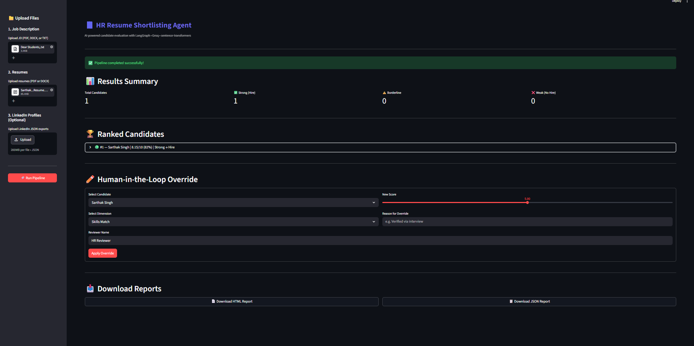
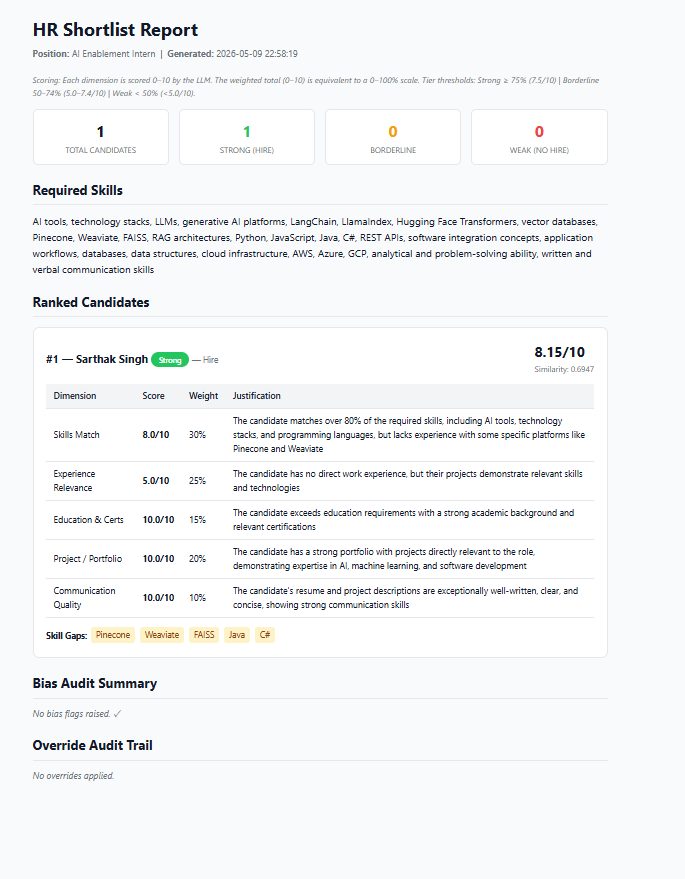

# HR Resume & LinkedIn Shortlisting Agent

[](https://python.org)
[](https://github.com/langchain-ai/langgraph)
[](https://groq.com)
[](https://streamlit.io)
[](LICENSE)

An AI-powered candidate evaluation pipeline built with **LangGraph**. Upload a Job Description and a batch of resumes — get a ranked, scored shortlist with bias audit in seconds.

---

## Table of Contents

- [What This Does](#what-this-does)
- [Screenshots](#screenshots)
- [Architecture](#architecture)
- [Node Reference](#node-reference)
- [Scoring Rubric](#scoring-rubric)
- [Bias Audit](#bias-audit)
- [LLM Choice and Rationale](#llm-choice-and-rationale)
- [Security](#security)
- [Quick Start](#quick-start)
- [Project Structure](#project-structure)
- [Sample Data](#sample-data)
- [Environment Variables](#environment-variables)
- [Tech Stack](#tech-stack)
- [Beyond the Assignment](#beyond-the-assignment)

---

## What This Does

HR teams screen hundreds of resumes per role — leading to fatigue, inconsistency, and unconscious bias. This agent automates the full evaluation pipeline end-to-end.

1. Parses a Job Description into structured requirements via LLM
2. Ingests resumes (PDF / DOCX / TXT) and LinkedIn profiles (JSON) **in parallel using async**
3. Scores every candidate across **5 weighted dimensions** with explicit 0 / 5 / 10 rubric anchors
4. Runs an automated **bias audit** to flag scoring anomalies
5. Generates a ranked HTML + JSON report with per-candidate skill gap analysis
6. Allows HR to **override any score** with a reason — every change logged to an audit trail

---

## Screenshots

**Landing Page — Upload JD and Resumes**




**Files Uploaded and Ready**

***added TCI JD and my own Resume for verification***




**Results Dashboard — Ranked Candidates with HITL Override**





**Generated HTML Report — Full Scoring Breakdown**




---

## Architecture

```
[1] JD Parser
     └── Extracts skills, experience, education from JD via LLM
                          |
          ┌──────────────┴──────────────┐
          ▼                             ▼
[2A] Resume Parser            [2B] LinkedIn Parser
     └── PDF / DOCX / TXT          └── JSON export
     ←── both run async, parallel per candidate ──→
          |                             |
          └──────────────┬──────────────┘
                         ▼
              [3] Profile Merge
                   └── resume wins on conflicts
                         |
                         ▼
              [4] Scoring Node
                   └── LLM scores 5 dimensions with 0/5/10 rubric anchors
                   └── Pydantic validates every output
                         |
                         ▼
              [5] Rank + Bias Audit
                   └── sort descending by weighted total
                   └── run 3 automated bias checks
                         |
                         ▼
              [6] Report Generator
                   └── HTML (Jinja2) + JSON export
                         |
                         ▼
              [7] HITL Override
                   └── HR adjusts any score with reason
                   └── full audit trail persisted to SQLite
```

---

## Node Reference

| # | Node | Function |
|---|------|----------|
| 1 | **JD Parser** | LLM extracts structured requirements — skills, experience, education — from the Job Description |
| 2A | **Resume Parser** | Reads PDF / DOCX / TXT, LLM converts to structured `CandidateProfile`. Runs async in parallel |
| 2B | **LinkedIn Parser** | Loads exported LinkedIn JSON, LLM structures into `CandidateProfile`. Runs async in parallel |
| 3 | **Profile Merge** | Combines resume and LinkedIn data for the same candidate. Resume wins on all conflicts |
| 4 | **Scoring** | LLM scores each candidate on 5 dimensions using full rubric anchors. Pydantic validates every output |
| 5 | **Rank** | Sorts by weighted total, assigns tier (Strong / Borderline / Weak), runs 3 bias checks |
| 6 | **Report** | Jinja2 renders professional HTML report. Also exports JSON for API consumers |
| 7 | **HITL Override** | HR inputs candidate ID, dimension, new score, and reason. Logged to SQLite with timestamp |

---

## Scoring Rubric

Each candidate is scored **0 – 10** per dimension. Rubric anchor points are passed directly to the LLM in the scoring prompt — not inferred.

| Dimension | Weight | **0 — Poor** | **5 — Average** | **10 — Excellent** |
|-----------|:------:|-------------|----------------|-------------------|
| **Skills Match** | 30% | < 30% skills match | 50 – 70% skills match | > 85% skills match |
| **Experience Relevance** | 25% | Unrelated domain | Adjacent domain | Exact domain + seniority |
| **Education & Certs** | 15% | Below minimum | Meets minimum | Exceeds + extra certs |
| **Project / Portfolio** | 20% | No evidence | 1 – 2 generic projects | Strong relevant portfolio |
| **Communication Quality** | 10% | Poor structure / grammar | Adequate clarity | Crisp, structured, impactful |

**Tier assignment** — weighted total × 10 gives a 0 – 100 percentage:

| Tier | Threshold | Recommendation |
|------|:---------:|----------------|
| 🟢 **Strong** | ≥ 75% | Hire |
| 🟡 **Borderline** | 50 – 74% | Maybe |
| 🔴 **Weak** | < 50% | No Hire |

---

## Bias Audit

Three automated checks run inside the Rank node after every scoring batch.

| Check | Trigger Condition | What It Means |
|-------|-------------------|---------------|
| **Profile Similarity Discrepancy** | Cosine similarity > 0.85 but score gap > 2.0 | Two very similar candidates scored very differently — possible inconsistency |
| **Keyword Stuffing** | Skills Match ≥ 7 AND Project score ≤ 3 | Candidate lists many skills but has no projects to back them up |
| **Scoring Variance** | Batch standard deviation > 3.0 | LLM scored inconsistently across candidates — human review recommended |

Any flagged candidates appear in the **Bias Audit Summary** section of the HTML report.

---

## LLM Choice and Rationale

**Model:** `llama-3.3-70b-versatile` via **Groq API**

| Factor | Decision |
|--------|----------|
| **Cost** | Free tier — 14,400 requests / day. No billing needed for development or demo |
| **Speed** | Groq LPU hardware delivers ~500 tokens / sec — candidates score in real time |
| **Structured output** | Full JSON mode — Pydantic `with_structured_output()` works reliably |
| **Context window** | 128K tokens — handles long resumes + detailed JDs in a single call |
| **Quality** | 70B parameter model delivers nuanced rubric evaluation comparable to GPT-4 class models |

**Why not GPT-4o or Claude Sonnet?** Both are stronger but require paid API keys. For a prototype with a free-tier constraint, Groq + Llama 3.3 70B delivers comparable structured output quality at zero cost and significantly faster latency.

---

## Security

| Risk | Mitigation |
|------|-----------|
| **Prompt Injection** | `utils/sanitiser.py` scans all input text for 9 known injection patterns (e.g. `ignore previous instructions`, `[INST]`, `<\|im_start\|>`) before any text enters a prompt. Suspicious content is logged but still processed |
| **PII in Logs** | All candidate names masked in console output via `mask_pii()` — e.g. `Sarthak Singh` → `S*****k S***h`. Raw names never appear in log files |
| **API Key Exposure** | `GROQ_API_KEY` loaded via `.env` + `python-dotenv`. `.env` is gitignored. `.env.example` with placeholders is committed instead |
| **Hallucination** | Every LLM call uses Pydantic `with_structured_output()`. Model must return a validated schema — free-text responses are rejected and retried |
| **Unauthorised Access** | Setting `APP_PASSWORD` in `.env` enables a password gate on the Streamlit UI |
| **Rate Limits** | All Groq calls wrapped with retry logic — 3 attempts with exponential backoff before failing gracefully |

---

## Quick Start

### Prerequisites

- Python 3.10 or higher
- A free [Groq API key](https://console.groq.com/keys) — takes about 30 seconds to create

### Installation

```bash
git clone https://github.com/yourusername/hr-resume-shortlisting.git
cd hr-resume-shortlisting
pip install -r requirements.txt
cp .env.example .env
```

Open `.env` and paste your `GROQ_API_KEY`.

### Run via CLI

```bash
# Place your JD in data/jd/ and resumes in data/resumes/
python main.py

# Report saved to output/report.html and output/report.json
```

### Run via Streamlit UI

```bash
streamlit run app.py
# Opens at http://localhost:8501
```

---

## Project Structure

```
hr-resume-shortlisting/
│
├── main.py                      # LangGraph graph assembly + CLI entry point
├── app.py                       # Streamlit UI
│
├── models/
│   └── schemas.py               # All Pydantic models + GraphState TypedDict
│
├── nodes/
│   ├── jd_parser.py             # Node 1 — JD parsing
│   ├── resume_parser.py         # Node 2A — Async resume parsing
│   ├── linkedin_parser.py       # Node 2B — Async LinkedIn parsing
│   ├── profile_merge.py         # Node 3 — Profile merging
│   ├── scoring.py               # Node 4 — LLM rubric scoring
│   ├── rank.py                  # Node 5 — Ranking + bias audit
│   ├── report.py                # Node 6 — HTML and JSON report generation
│   └── hitl.py                  # Node 7 — Human-in-the-loop override
│
├── utils/
│   ├── llm_client.py            # Groq client wrapper with retry logic
│   ├── doc_reader.py            # PDF / DOCX / TXT reader (pdfplumber)
│   ├── embeddings.py            # Sentence-transformer wrapper
│   ├── bias_audit.py            # 3-check bias detection logic
│   └── sanitiser.py             # Input sanitisation and PII masking
│
├── templates/
│   └── report.html              # Jinja2 HTML report template
│
├── data/
│   ├── jd/                      # Drop JD files here (.txt / .pdf)
│   ├── resumes/                 # Drop resume files here (.pdf / .docx / .txt)
│   └── linkedin/                # Drop LinkedIn JSON exports here
│
├── output/                      # Generated reports (gitignored)
├── .env.example
├── requirements.txt
└── pyproject.toml
```

---

## Sample Data

The `data/` directory includes a complete test set. Run `python main.py` out of the box.

| File | Candidate Profile | Expected Result |
|------|-------------------|-----------------|
| `candidate_1.txt` | AI/ML engineer — LangChain, FastAPI, 3 years experience, strong projects | 🟢 **Strong** — Hire |
| `candidate_2.txt` | Backend developer — some Python, no LLM experience, adjacent domain | 🟡 **Borderline** — Maybe |
| `candidate_3.txt` | Fresh graduate — Java background, minimal Python, no AI projects | 🔴 **Weak** — No Hire |
| `candidate_4.txt` | Keyword stuffer — large skills list, vague project descriptions | ⚠️ **Bias flagged** |

**JD:** Mid-Level AI / ML Engineer at a product startup. Requires Python, LangChain, FastAPI, Docker, AWS.

---

## Environment Variables

```env
# Required
GROQ_API_KEY=your_groq_api_key_here

# Optional
APP_PASSWORD=your_password     # enables password gate on Streamlit UI
```

---

## Tech Stack

| Layer | Technology |
|-------|-----------|
| **Agent Framework** | LangGraph |
| **LLM** | Llama 3.3 70B via Groq API |
| **Embeddings** | `sentence-transformers` — `all-MiniLM-L6-v2` |
| **Resume Parsing** | `pdfplumber` + `python-docx` |
| **Output Validation** | Pydantic v2 — `with_structured_output()` |
| **Report Generation** | Jinja2 HTML + JSON |
| **UI** | Streamlit |
| **Audit Logging** | SQLite |

---

## Beyond the Assignment

Three engineering additions built on top of the core assignment requirements.

### Async Parallel Processing

The assignment did not require parallel execution. By default, scoring 10 resumes sequentially with LLM calls takes ~30 seconds.

Nodes 2A and 2B use `async def` with `asyncio.to_thread` and `asyncio.gather` so every candidate is parsed simultaneously. The graph is invoked via `ainvoke` — LangGraph handles async nodes natively.

**Result:** 10 resumes process in the time it previously took to process 1.

---

### Pydantic Structured Output on Every LLM Call

The assignment required a scoring rubric output but did not specify how LLM responses should be validated.

Every single LLM call in this pipeline uses `with_structured_output()` with a Pydantic model. The LLM cannot return a vague or malformed response — if schema validation fails, the node retries automatically.

**Result:** Zero string parsing anywhere in the codebase. Hallucinated or incomplete scores are caught before they reach the report.

---

### Bias Audit Node

The assignment brief mentioned unconscious bias as the core business problem but did not require any automated bias detection.

The Rank node runs three checks after every scoring batch — profile similarity discrepancy, keyword stuffing detection, and scoring variance. Any flagged candidates appear in the Bias Audit Summary section of the report with the specific flag reason.

**Result:** HR sees not just who ranked highest, but whether the scoring itself can be trusted.

---

## License

MIT